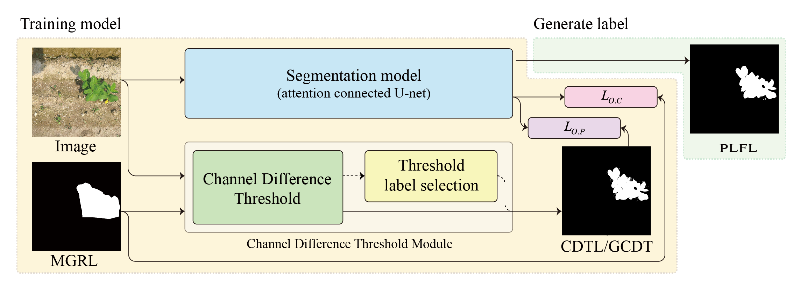
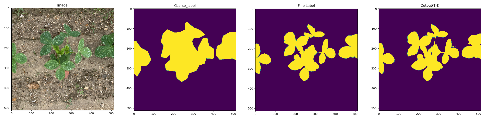
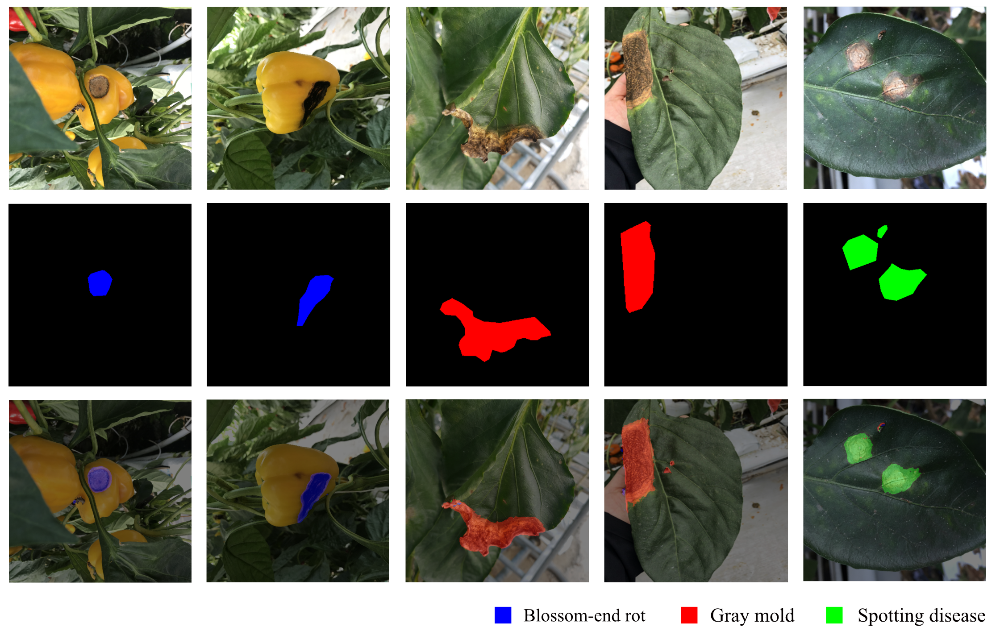

# A Pixel-Level Coarse-to-Fine Segmentation Labelling Algorithm

## Abstract

Fine segmentation labelling tasks are time consuming and typically require a great deal of manual labor. This paper presents a novel method for efficiently creating pixel-level fine segmentation labelling that significantly reduces the amount of necessary human labor. The proposed method utilizes easily produced multiple and complementary coarse labels to build a complete fine label via supervised learning. The primary label among the coarse labels is the manual label, which is produced with simple contours or bounding boxes that roughly encompass an object. All others coarse labels are complementary and are generated automatically using existing computer algorithms. Fine labels can be rapidly created during the supervised learning of such coarse labels. In the experimental study, the proposed technique achieved a fine label IOU (intersection of union) of 92% in segmenting our newly constructed bean field dataset. The proposed method also achieved 95% and 92% mean IOU when tested on publicly available agricultural CVPPP and CWFID datasets, respectively. Our proposed method of segmentation also achieved a mean IOU of 81% when it was tested on our newly constructed paprika disease dataset, which includes multiple categories.

This repo contains the scripts for the reproduction of results of [this paper](http://)   
Just core scripts are extracted by origin project.

## Environments
See `requirements.txt`

## Dataset
- Bean leaf dataset : `data/bean_leaf`
- Circle dataset : `data/circle_noise`
- Paprika disease dataset : `data/paprika_disease`

## Models
Two type of model included in `./models`

1. ``./model/UNet_.py``  
**UNet** model using transpose convolution.

2. ``./model/UNet_weight_connection.py``  
**UNet** model using transpose convolution with weighted skip connection.

## Architecture  

## Result   
### 1. bean leaf result   
   

### 2. paprika disease result   

